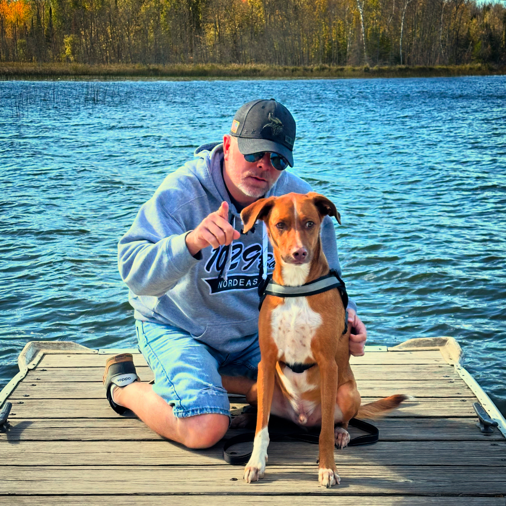
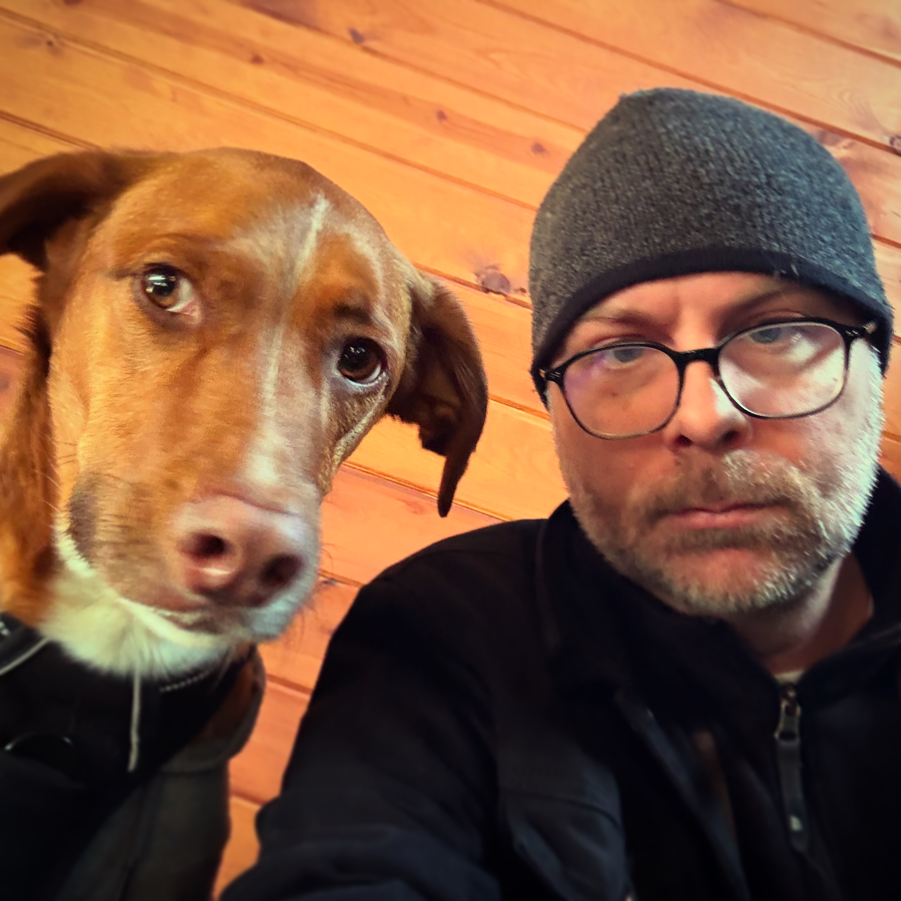
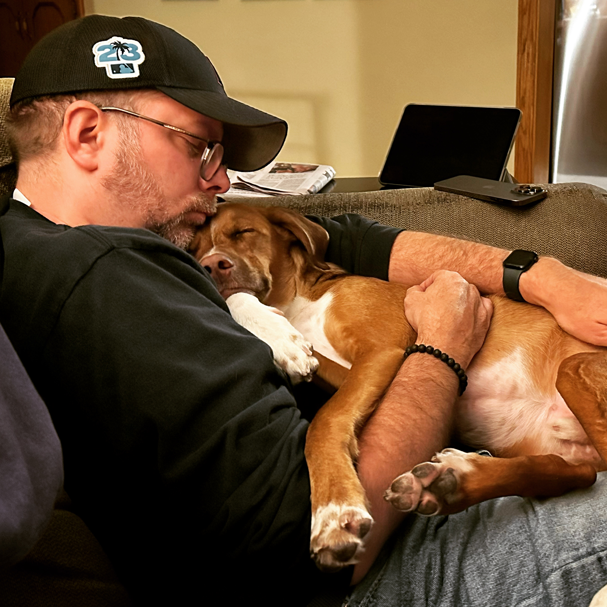
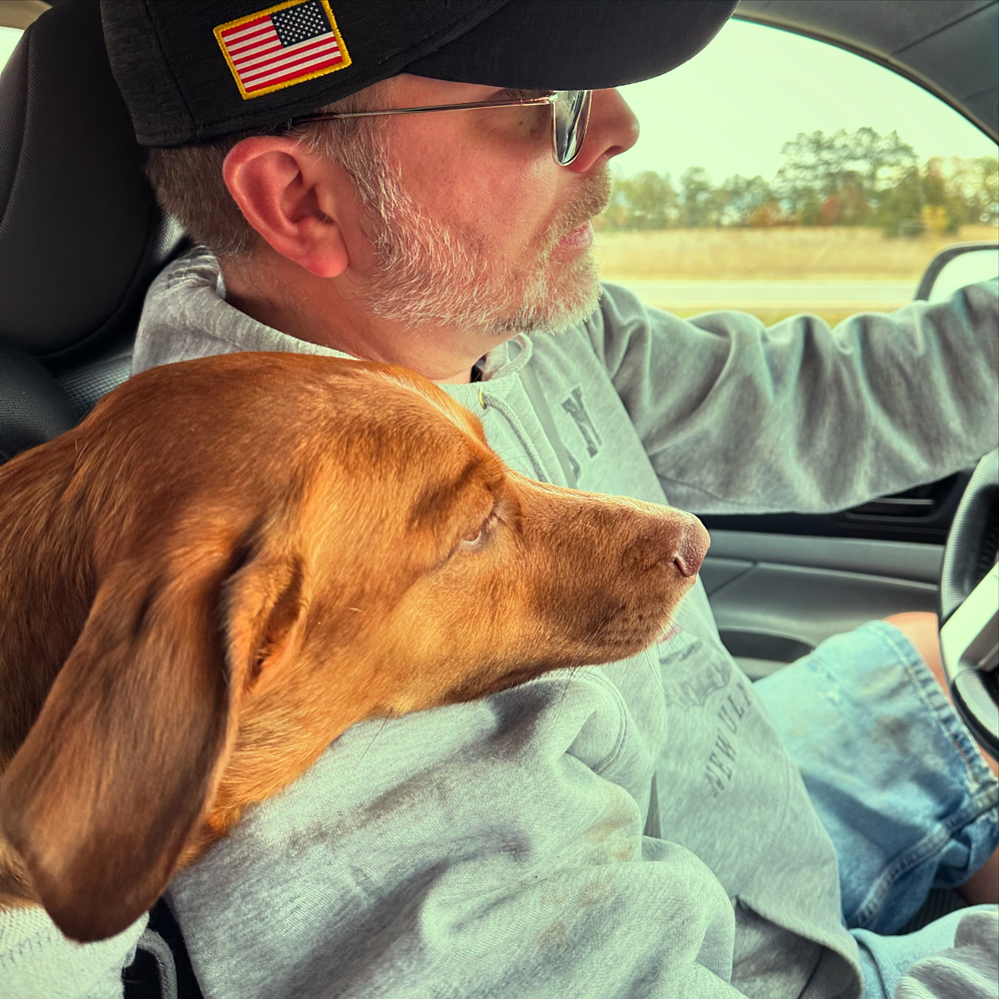

# Hey, I'm Chad Juettner

**Software Developer & Consultant | Minneapolis, MN | 25+ Years Building Software**

Chad Juettner has been shipping code for 25+ years—Fortune 500 to “we’ll figure out payroll next month.”

Now it’s mostly AI: agentic systems, experiments, and software that feels alive again.

Most of the photos here feature my dog, Otis. A few years ago I walked into Dusty's Bar in Northeast Minneapolis after a Twins game, I walked out with a dog. He still has no idea what I do for a living.

---

<table>
  <tr>
    <td>
      
    </td>
    <td>
      
    </td>
  </tr>
</table>

---

<table>
  <tr>
    <td>
      
    </td>
    <td>
      
    </td>
    <td>
      
    </td>
  </tr>
</table>

<table>
  <tr>
    <td>
      
    </td>
    <td>
      
    </td>
    <td>
      
    </td>
  </tr>
</table>

<table>
  <tr>
    <td>
      
    </td>
    <td>
      
    </td>
  </tr>
</table>

---

### What I'm Working On

- AI development and machine learning applications
- Building with Java, Spring Boot, and modern cloud architectures
- Exploring generative AI tooling and workflows

### Connect

- [Website](https://chad.juettner.dev)
- [LinkedIn](https://linkedin.com/in/juettner)
- [Bluesky](https://bsky.app/profile/juettner.dev)
